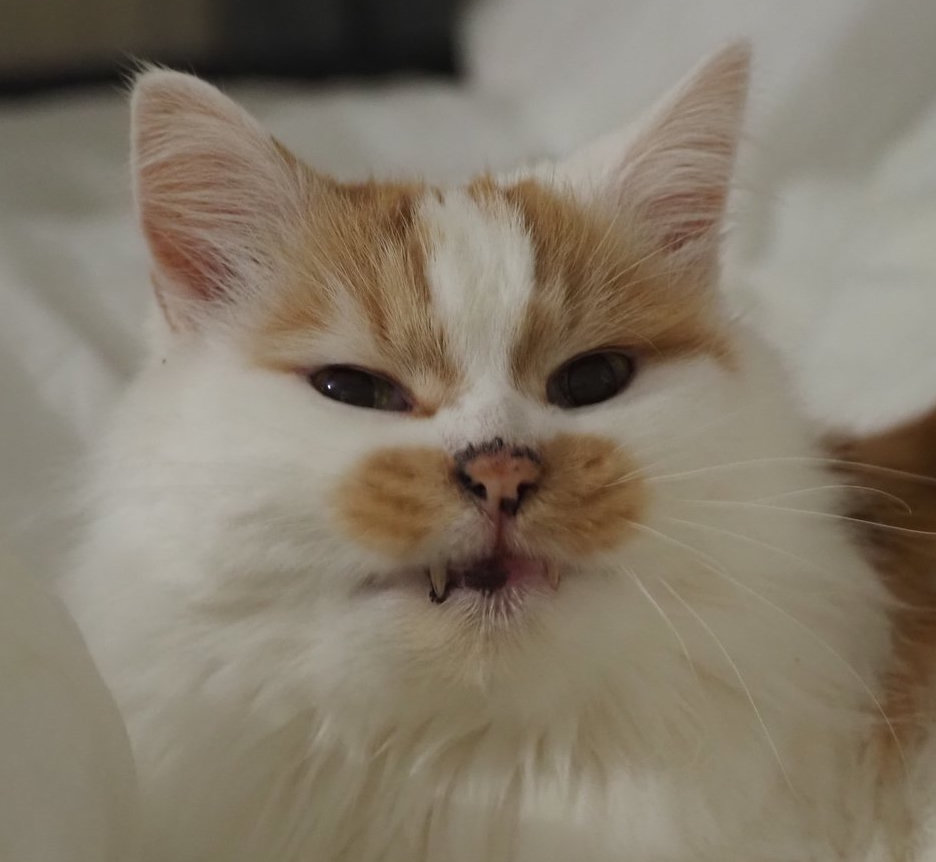
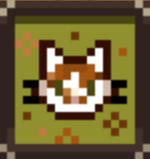
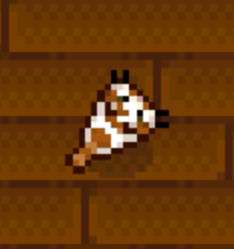

# StardewValleyMods

    <figure>
        
        <figcaption>A collection of mods based on Gizmo

    </figure>

## Mod overviews
These rely on the [Content Patcher](https://www.nexusmods.com/stardewvalley/mods/1915?tab%3Dfiles) framework to work.

| Mod     | Descrition | Example image         |
| ----------- | :------------: | :------------: |
| Decormo | Adds Gizmo themed pictures and rugs. |  |
| Fishmo | Adds a fish based on Gizmo.|  |

## Installation
Should anyone be interested in using these (rather specific) mods, the installation is the same as other standard Content Patcher mods. No unique configuration is required to enable any of the featured mods to work.

If this would be your first time installing Stardew Valley mods then the [wiki guide](https://stardewvalleywiki.com/Modding:Player_Guide/Getting_Started) is a good place to start.

## Requirements
* [SMAPI](https://smapi.io/)
* [Content Patcher](https://www.nexusmods.com/stardewvalley/mods/1915?tab%3Dfiles)

These were made after the 1.6 update so might not be compatible with previous game versions.